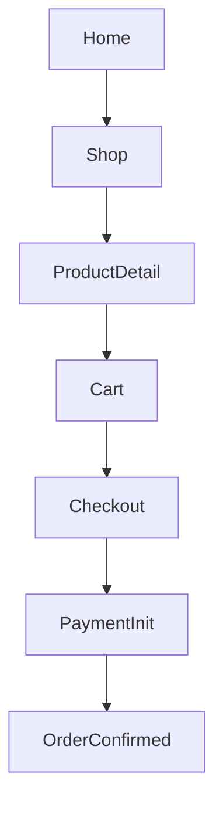
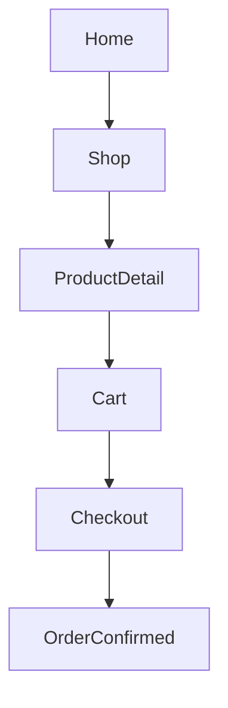
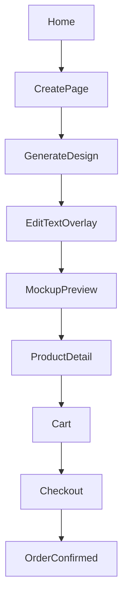

# IMPLEMENTATION REPORT

## 1. Architecture overview

- Stack: Next.js App Router + TypeScript + Tailwind + PostgreSQL/Prisma + pgvector-ready schema.
- Architecture style: feature-based modular monolith with package boundaries:
  - `apps/web` (UI + API routes/BFF)
  - `packages/domain` (pure business rules)
  - `packages/application` (use-cases/orchestration)
  - `packages/infrastructure` (provider adapters)
  - `packages/contracts` (API schemas and route contracts)
- API-first design with contract validation (`zod`) for key flows.
- Adapter pattern used for AI generation, payment, and supplier operations.

## 2. Module breakdown

- Design Engine: prompt validation, AI generation endpoint, status output.
- Product Engine: catalog and product detail APIs with VAT-visible pricing.
- Configuration Engine: variant validation and configurable product path.
- Preview Engine: product preview endpoint (`/api/previews`), fallback-ready.
- Search Engine: `/shop` listing uses `GET /api/search` (merged ranking surface); legacy `/search` URL redirects to `/shop`.
- AI Cost Control Engine: daily limit + per-minute rate limiting in `ai-guard`.
- Order Management: checkout and payment-init flow, recoverable state handling.
- Supplier Integration Layer: supplier adapter with availability checks.
- Returns & Dispute Engine: returns endpoint + domain abuse rules.
- User System: role contracts defined and account area scaffolded.
- Admin Panel: KPI/orders/returns/moderation sections and APIs.
- Analytics: admin KPI endpoint with dashboard-ready payload.

## 3. Data model (with explanations)

Implemented in `prisma/schema.prisma`:

- Required:
  - `User`: identity + role + relations.
  - `Product`: catalog item and VAT settings.
  - `Variant`: size/color/material/price/stock per product.
  - `Supplier`: adapter identity and active state.
  - `Design`: AI/internal/external source, prompt hash, moderation fields.
  - `ProductConfiguration`: product + variant + optional design + text overlay + preview image.
  - `Order`: monetary totals and payment/order status lifecycle.
  - `OrderItem`: ordered configuration snapshot and VAT-aware price fields.
  - `ReturnRequest`: reason/status with abuse score support.
- Supporting:
  - `Cart`, `CartItem`, `PaymentAttempt`, `AiUsageLedger`, `SearchEmbedding`, `ModerationAction`, `AuditLog`.
- pgvector-ready columns are included via `Unsupported("vector")`.

## 4. Flow diagrams (all flows)

### Quick Buy

### Inspire (browse / filters on shop)

### Create

## 5. Test matrix

Primary matrix and strategy are documented in:
- `docs/TEST_PLAN.md`
- `docs/TEST_MATRIX.md`

Executed coverage includes:
- Domain tests for pricing, config validation, AI limits, dedupe, payment recovery, return abuse.
- Contract tests for API schemas/routes.
- E2E tests for mandatory flows: shop browse (Quick Buy / Inspire path), Create, cart, checkout; full `coherence.spec.ts` requires `REDIS_URL` (workers).

## 6. Edge cases handled

- AI timeout: modeled in schema/status design (`timed_out`) and test planning.
- Duplicate designs: prompt hash/perceptual hash fields + dedupe domain logic.
- Supplier unavailable: stock is enforced at order creation time via variant `stock` decrements.
- Invalid variant: strict domain validation path.
- Preview failure: preview endpoint is isolated and fallback-ready by design.
- User spam/AI abuse: per-minute limiter + daily limit.
- Payment failure: recoverable order state in domain logic.
- Return abuse: rule-based escalation in returns domain function.

## 7. API structure

- Auth:
  - `POST /api/auth/register`
  - `POST /api/auth/login`
  - `GET /api/auth/me`
  - `POST /api/auth/logout`
- Catalog:
  - `GET /api/products`
  - `GET /api/products/:id`
- Inspire/Search:
  - `GET /api/search`
- Create:
  - `POST /api/designs/generate`
  - `POST /api/designs/:id/edit`
  - `POST /api/previews`
- Cart/Checkout/Payments:
  - `GET /api/cart`
  - `POST /api/cart/items`
  - `PATCH /api/cart/items`
  - `DELETE /api/cart/items`
  - `POST /api/orders`
  - `GET /api/orders`
  - `GET /api/account/orders`
  - `POST /api/checkout` (validated payload + payment intent)
  - `POST /api/payments/przelewy24/init`
  - `POST /api/payments/przelewy24/webhook`
- Returns:
  - `POST /api/returns`
- Admin:
  - `GET /api/admin/kpi`
  - `GET /api/admin/orders`
  - `GET /api/admin/returns`
  - `GET /api/admin/moderation`

## 8. UX structure (screens + logic)

- Homepage: hero CTA, categories, create CTA, trending designs, collections; links target `/shop` and template-aligned routes.
- Shop (`/shop`): filters sidebar, query + sort, product grid (`GET /api/search`); replaces former `/search` + `/products` split.
- Product page: dynamic preview area, variant choices, VAT-visible price, edit/create CTA.
- Create page: prompt input, async generate states, text overlay field, non-blocking UX.
- Cart: configuration and pricing breakdown area.
- Checkout: address and payment start action.
- Account: orders and returns sections.
- Admin: KPI/orders/returns/moderation/product-supplier management sections.
- Navigation keeps one primary guided path while exposing alternate flows.

## 9. Performance strategies

- Contract-level validation to fail fast and prevent expensive processing.
- Prompt-level caching via provider-level cache strategy.
- AI rate limits (daily + per-minute) to control spend/abuse.
- API modularization supports moving heavy operations to async workers later.
- Prisma schema prepared for indexing and vector search expansion.

## 10. What is NOT implemented yet (future-ready notes)

- Przelewy24 signature verification and full provider-specific reconciliation details.
- Advanced moderation/analytics persistence workflows still pending.
- Production tuning for pgvector index strategy (IVFFlat/HNSW) and offline embedding backfills.
- Durable queue backend (Redis/SQS) with retry policies and dead-letter handling.
- Comprehensive admin moderation workflows and analytics warehouse exports.

## 11. Database Implementation (REAL)

- All core entities are persisted through PostgreSQL/Prisma models.
- Runtime data paths for users, carts, cart items, product configurations, and orders are database-backed.
- Added structural constraints/indexes for high-frequency lookups:
  - `User.email` unique
  - `AiUsageLedger(userId, dayKey)` unique
  - cart, order, return, product, and variant indexes for query paths
- Added `termsAcceptedAt` to `User` and relation-backed integrity between cart/order/configuration records.

## 12. Removed Mock Systems (LIST WHAT WAS REMOVED)

- Removed previous volatile data-store module from `apps/web/src/lib`.
- Replaced in-memory cart/design/product state with repository + Prisma persistence.
- Replaced route-level fake storage writes with repository writes:
  - cart items
  - cart reads
  - design generation records
  - order creation from persisted cart
- AI image URLs and payment redirect URLs are synthesized at the provider boundary until production credentials are configured.

## 13. Authentication Flow

- Register: `POST /api/auth/register`
  - validates payload with zod
  - hashes password with bcrypt
  - creates user in DB
  - stores HTTP-only session cookie with JWT
- Login: `POST /api/auth/login`
  - validates credentials
  - verifies password hash
  - refreshes session cookie
- Session check: `GET /api/auth/me`
  - resolves user from signed cookie session
- Protected route middleware enforces session for cart, checkout, orders, returns, designs, account, admin, and payment-init API paths.

## 14. Persistence Proof (HOW DATA IS VERIFIED IN DB)

- Playwright `globalSetup` runs `prisma migrate deploy` and `prisma db seed` before E2E so the app always targets a real migrated schema plus baseline catalog data.
- Local database: use `docker compose up -d` (see `docker-compose.yml`) or any PostgreSQL 16+ instance with the `vector` extension available; set `DATABASE_URL` and `JWT_SECRET` in `.env` (see `.env.example`).
- `npm run dev` loads `.env` via `dotenv-cli` so Next.js and Prisma share the same connection string.
- Integration-style API tests in `apps/web/e2e/persistence.spec.ts` verify:
  - registration/login with persisted user/session
  - add-to-cart then read cart again (data survives request boundaries)
  - create order from cart and verify order exists in subsequent `GET /api/orders`
- Repositories are the only write path from routes to storage for User/Product/Cart/Order operations.
- No in-memory arrays are used as runtime storage for cart/order/user/product/design records.

## 15. Transaction Handling

- `OrderRepository.createFromCart` runs as a single DB transaction for:
  - cart validation
  - order + order items creation
  - stock reservation/decrement
  - cart deactivation
- If any operation fails (e.g. stock check/update race), Prisma transaction throws and all writes roll back.
- Integration test: `packages/infrastructure/src/repositories/hardening.integration.test.ts` verifies rollback leaves stock/cart/order unchanged.

## 16. Concurrency Control

- Stock protection uses optimistic locking on `Variant`:
  - new `version` column
  - guarded `updateMany` with `where: { id, version, stock >= qty }`
  - atomic `stock decrement + version increment`
- This prevents overselling under concurrent order creation.
- Integration test validates two concurrent orders competing for stock result in exactly one success.

## 17. Idempotency Strategy

- Added `IdempotencyRecord` table with unique `(scope, key)`, request hash, stored response body/status, and in-flight marker.
- Implemented `IdempotencyRepository` + `withIdempotency` helper:
  - first request: reserves key and executes handler
  - duplicate same payload: returns stored response
  - duplicate different payload: `409 CONFLICT`
  - in-flight duplicate: `409 CONFLICT`
- Applied to:
  - `POST /api/checkout`
  - `POST /api/payments/przelewy24/webhook`
  - `POST /api/orders` (additional safety for duplicate order creation)

## 18. Order State Machine

- Canonical statuses now:
  - `created`
  - `payment_pending`
  - `paid`
  - `failed`
  - `shipped`
  - `completed`
- Transition rules enforced in `apps/web/src/lib/order-state-machine.ts`.
- All transitions are validated before update, and persisted in `OrderTransitionLog`.
- Added admin transition endpoint:
  - `PATCH /api/orders/:id/status`
  - rejects invalid transitions with `400`.

## 19. AI Integration (REAL)

- Replaced AI stub generation with real OpenAI Images HTTP call (`/v1/images/generations`) in infrastructure adapter.
- Added robust error surface:
  - missing key: `openai_api_key_missing`
  - upstream non-2xx: `openai_image_failed:*`
  - malformed/empty payload handling.
- Design generation is now async:
  - create design with `pending` status
  - queue worker executes generation
  - status becomes `completed` with `imageUrl`, or `failed` with `errorMessage`.
- Added endpoint for status polling:
  - `GET /api/designs/:id`

## 20. Mockup Engine Implementation

- Implemented server-side compositing with `sharp` in `packages/infrastructure/src/mockup-engine.ts` (`generateMockupPngBuffer` / `generateMockupDataUrl`):
  - generated base product canvas
  - downloaded/decoded AI design image
  - composited design + optional text overlay
- `POST /api/previews` checks `MockupCache` by deterministic cache key (`productId` + `variantId` + `designId` + `textOverlay`); on miss enqueues BullMQ mockup job and returns `202` with `jobId` + `pollJobUrl`.
- Workers write PNG files under `apps/web/public/generated/mockups` (override with `GENERATED_MOCKUPS_DIR`) and expose stable URLs (`PUBLIC_ASSET_BASE_URL` + `/generated/mockups/{key}.png`).

## 21. Queue System (BullMQ / Redis)

- Added workspace package `@shirt/jobs` with BullMQ queues: `ai-generation`, `mockup-generation`.
- Redis service in `docker-compose.yml` (`redis:7-alpine`, AOF on) and `REDIS_URL` in `.env.example`.
- API routes enqueue jobs with stable BullMQ `jobId` = `BackgroundJob.id` for correlation.
- Run workers separately: `npm run workers` (loads `.env`, executes `scripts/workers.ts` → `runAllWorkers()`).
- `BackgroundJob` Prisma model tracks status, attempts, payload, result, and dead-letter terminal state.

## 22. Retry Strategy

- Default BullMQ options (`packages/jobs/src/queue-config.ts`): `attempts: 5`, exponential backoff base delay `2000ms` (doubles per attempt).
- Worker updates `BackgroundJob.attemptCount` / `errorReason` on intermediate failures; successful runs set `completed` with `result` JSON.

## 23. Dead Letter Handling

- When attempts are exhausted, workers mark `BackgroundJob.status = dead_letter` and persist `errorReason` (AI jobs also mark the `Design` as `failed`).
- Admin listing: `GET /api/admin/jobs?status=dead_letter` (default).
- Admin retry: `POST /api/admin/jobs/:id/retry` resets the row and re-enqueues (AI jobs reset design to `pending`).

## 24. Caching Strategy

- Mockup: `MockupCache` table keyed by SHA-256 of product + variant + design + overlay text; worker short-circuits on cache hit.
- Rate limit buckets use Redis when `REDIS_URL` is set; otherwise in-memory fixed window (per-process) for local dev.
- Generated mockup files on disk are reused via public URL path (CDN-ready via `PUBLIC_ASSET_BASE_URL`).

## 25. Search Ranking Logic

- Hybrid score in `apps/web/src/lib/search-ranking.ts`: blends vector similarity (from pgvector query), normalized `Product.popularityScore` (incremented on order placement), and recency boost from `Product.createdAt`.
- `diversifyByType` limits how many results share the same `Product.type` before backfilling, reducing duplicate-feeling grids.
- Lexical filter still applies as baseline; semantic path activates for queries length ≥ 3.

## 26. Rate Limiting

- Shared helper `checkRateLimit` (`apps/web/src/lib/rate-limit.ts`) with per-IP and optional per-user limits over a 60s window.
- Applied to: `GET /api/search`, `POST /api/designs/generate`, `GET /api/cart`, `POST|PATCH|DELETE /api/cart/items`, `GET|POST /api/orders`, `POST /api/checkout`, `POST /api/payments/przelewy24/init`, `POST /api/previews`.
- Violations return `429` with `RATE_LIMITED` and `Retry-After` header (`apiRateLimited`).

## 27. Audit System

- `Order` transitions already logged in `OrderTransitionLog`; `OrderRepository.updateStatus` now also writes `AuditLog` rows (`eventType: order_status_change`).
- Return admin decisions: `PATCH /api/admin/returns/:id` writes `AuditLog` (`eventType: return_decision`) with previous/new status.
- Order soft delete: `POST /api/admin/orders/:id/archive` sets `Order.deletedAt` and audits (`order_soft_delete`). List/read paths filter `deletedAt IS NULL`.
- `ReturnRequest` includes `deletedAt` for soft-delete support (queries filter active rows in admin listings).

## 28. Frontend Architecture

- App Router frontend uses `next-intl` with locales `pl` (default) and `en` (`localePrefix: as-needed`, so Polish URLs omit `/pl`).
- Route groups:
  - `(store)` shop shell: `/`, `/shop`, `/product/[id]`, `/auth/signin`, `/auth/signup`, `/auth/forgot-password`, `/blog`, `/blog/[slug]`, `/docs`, `/support`, `/create`, `/cart`, `/checkout`, `/account`, … — shared `ShopHeader` + `ShopFooter`. Legacy `/login`, `/register`, `/products`, `/search` redirect (see §56).
  - `admin`: Materio auth routes under `(auth)/`; panel under `(panel)/` with `AdminShell` (drawer + per-route pages, no tab router). `/admin` index redirects toward dashboard when session allows.
- Shop uses Tailwind (`solid-section`, `solid-card`, `solid-card-hover`) plus optional `next/image` for catalog and marketing imagery.
- Data flow remains API-first; client pages use loading, empty, and error affordances.

## 29. Template Mapping (what reused from templates)

- Shop template mapping (`solid-nextjs` reference):
  - top nav + wide container + hero CTA structure
  - sidebar filters + product grid pattern
  - product detail split layout (media left, purchase context right)
  - card spacing, rounded borders, section rhythm, typography hierarchy
- Admin template mapping (`materio` reference):
  - persistent left drawer
  - top app bar
  - KPI cards, charts (`recharts`), tables; orders / returns / designs / jobs each on its **own route** (not one-page tabs)
  - Material UI components for layout primitives and list/card controls

## 30. UX Decisions (how flows implemented)

- Non-blocking async design:
  - Create page shows pending generation state and polls status endpoint
  - Preview generation supports queued job completion via job polling
- Cart and checkout flows prioritize short paths and clear status feedback.
- Error/empty/loading states are rendered on shop and account screens instead of silent failures.
- Admin lists render raw operational records to reduce ambiguity during moderation and queue triage.

## 31. API Integration (frontend ↔ backend)

- Connected endpoints:
  - Search: `GET /api/search`
  - AI generation: `POST /api/designs/generate` + `GET /api/designs/:id`
  - Preview: `POST /api/previews` + `GET /api/jobs/:id`
  - Cart: `GET /api/cart`, `POST /api/cart/items`
  - Orders/checkout: `POST /api/orders`, `POST /api/checkout`
  - Account: `GET /api/account/orders`
  - Admin: `GET /api/admin/kpi|orders|returns|jobs|moderation`, `POST /api/admin/designs/:id/moderate`, plus job retry and return/archive actions
- All critical user operations surface backend response states in UI messaging.

## 32. UI Template Verification

- **Solid (shop)** — Structural alignment with [Solid Next.js](https://solid.demo.nextjstemplates.com/) / [solid-nextjs](https://github.com/NextJSTemplates/solid-nextjs/):
  - Sticky top bar, centered max-width container (`solid-section`), card-based surfaces (`solid-card`), hero with eyebrow + H1 + dual CTAs + imagery grid, category tiles, product grid with consistent gaps, testimonial cards, closing gradient CTA band.
  - Tailwind-only shop chrome (no MUI on storefront).
- **Materio (admin)** — Alignment with [Materio MUI Next.js Admin Template Free](https://demos.themeselection.com/materio-mui-nextjs-admin-template-free/demo) / [materio-mui-nextjs-admin-template-free](https://github.com/themeselection/materio-mui-nextjs-admin-template-free):
  - Permanent left drawer (~260px), light app bar, content on `#F5F5F9`, primary accent `#9155FD`, KPI stat cards, data tables in bordered `Paper`, moderation cards with actions.
- **Images**: Remote `images.unsplash.com` allowed in `next.config.ts` for marketing and catalog thumbnails (`catalog-images` slug map + seed slugs).

## 33. Localization System

- **Library**: `next-intl` with plugin in `next.config.ts` and request config in `src/i18n/request.ts`.
- **Routing**: `src/i18n/routing.ts` — locales `pl`, `en`; default `pl`; `localePrefix: as-needed`.
- **Middleware**: `src/middleware.ts` chains `next-intl` middleware for page routes and preserves JWT session checks for protected `/api/*` paths.
- **Messages**: `apps/web/messages/pl.json` (default copy) and `en.json`; namespaces include `nav`, `common`, `home`, `search`, `products`, `product`, `create`, `cart`, `checkout`, `account`, `auth`, `admin`, `footer`.
- **Navigation**: `src/i18n/navigation.ts` exports localized `Link`, `useRouter`, `usePathname`, etc.
- **Switcher**: `LanguageSwitcher` (PL/EN) in `ShopHeader`; switches locale while preserving path.
- **Admin**: Same message files (`useTranslations("admin")`, `adminAuth`, `common`, …) for auth + panel.

## 34. Auth UI Implementation

- **Store routes**: `/auth/signin`, `/auth/signup`, `/auth/forgot-password` under `(store)` (localized). Solid-style layout: **Magic link** vs **Password** tabs; SSO buttons (UI stub / disabled as agreed). Legacy `/login` and `/register` redirect here (§56).
- **Admin routes**: `/admin/login`, `/admin/register`, `/admin/forgot-password` under `(auth)/` — Materio-styled cards, separate from store pages; same session cookie after `POST /api/auth/login` when role is `admin`.
- **Login**: Password tab → `POST /api/auth/login`; errors mapped (`UNAUTHORIZED` → translated message); success → `/account` (store) or `/admin/dashboard` (admin).
- **Register**: `POST /api/auth/register` with `termsAccepted: true`; `CONFLICT` on duplicate email; redirects analogous to login flow.
- **Session**: HTTP-only cookie; protected `/api/*` unchanged (middleware).

## 35. Page Section Breakdown

Each row lists **sections → main components → purpose**.

### Home (`/`)

| Section | Components | Purpose |
| --- | --- | --- |
| Hero | `Link` (CTAs), `Image` grid, typography | Value proposition and primary funnels to `/shop` / AI create. |
| Categories | Three `Link` cards with `Image` | Drive traffic to filtered shop (t-shirt / hoodie / mug). |
| Trending | `ProductCardImage`, product `Link`s | Social proof of assortment; min. 8 items from DB ordered by `popularityScore`. |
| How it works | Three step cards | Explain search/create → configure → checkout. |
| Social proof | Rating chip + three blockquotes | Trust and qualitative reviews. |
| CTA band | Gradient panel + `Link` | Final conversion to shop. |

### Shop (`/shop`)

| Section | Components | Purpose |
| --- | --- | --- |
| Filters sidebar | Text filter, radio type filters | Narrow catalog; `?type=` from home pre-selects type via `useSearchParams`. |
| Results | Sort `<select>`, product grid with `ProductCardImage` | Browse and sort (`GET /api/search` with `sort` query). |

### Product detail (`/product/[id]`)

| Section | Components | Purpose |
| --- | --- | --- |
| Media | `next/image` + `productImageUrl` | Visual mockup-style presentation by slug/type. |
| Buy box | Variant `<select>`, price for selected variant, add to cart, link to create | Configure and add line to cart via `POST /api/cart/items`. |
| Delivery | Info panel | Set expectations for PL shipping and lead time. |

### Create (`/create`)

| Section | Components | Purpose |
| --- | --- | --- |
| Prompt | `textarea`, example prompt chips, generate button | Start AI generation (`POST /api/designs/generate`). |
| Results grid | Job/status card, overlay + preview actions, preview image | Poll design status; build mockup via `POST /api/previews` and job poll. |

### Cart (`/cart`)

| Section | Components | Purpose |
| --- | --- | --- |
| Line items | Thumbnails (`ProductCardImage`), quantities × price | Reflect `GET /api/cart`. |
| Empty state | Copy + links to home/shop | Guided recovery (no bare “empty”). |
| Summary | Total, delivery note, checkout `Link` | Proceed to checkout when items exist. |

### Checkout (`/checkout`)

| Section | Components | Purpose |
| --- | --- | --- |
| Address | Controlled inputs | Collect delivery identity (submitted in `POST /api/checkout` body). |
| Payment | Przelewy24 CTA | Create order then checkout intent. |
| Summary | Address recap + hint | Confirm what will be paid for. |

### Account (`/account`)

| Section | Components | Purpose |
| --- | --- | --- |
| Orders | List from `GET /api/account/orders`, skeleton loading | Order history; empty state with CTA. |
| Returns | Copy + support CTA | Explain return policy path (no dead end). |

### Store auth (`/auth/signin`, `/auth/signup`, `/auth/forgot-password`)

| Section | Components | Purpose |
| --- | --- | --- |
| Form / tabs | Magic link vs password, SSO row (stub), fields, validation | Authenticate or recover; cross-links between signin/signup/forgot. |

### Admin (Materio — route per concern)

| Route | Section | Components | Purpose |
| --- | --- | --- | --- |
| `/admin/login` (and register/forgot) | Auth | MUI card, fields, links | Session gate; no shop chrome. |
| `/admin/dashboard` | Overview | KPI cards, Recharts, recent orders | `GET /api/admin/kpi` + orders snippet. |
| `/admin/orders` | Operations | `Table` in `Paper`, row dialog, transitions | Fulfillment + `PATCH` order status. |
| `/admin/returns` | Operations | Table, decide dialog | `PATCH /api/admin/returns/:id`. |
| `/admin/designs` | Moderation | Cards/table, approve/reject | `POST /api/admin/designs/:id/moderate`. |
| `/admin/jobs` | Queue | Filters, table, retry, debug dialog | `GET /api/admin/jobs`, `POST …/retry`. |
| `/admin/account-settings` | Profile stub | Read-only email + save stub | Placeholder for account forms. |
| Shell | All panel routes | `AdminShell`: `Drawer`, `AppBar`, `Link` nav | Route-based navigation (not tab state). |

## 36. State visualization

- **Orders (customer)**: `GET /api/account/orders/:id` returns timeline steps and transition history; account order detail uses `OrderTimelineStrip` plus “what happens next” hints aligned with `ORDER_TIMELINE_FLOW` / `getAllowedOrderTransitions`.
- **Orders (admin)**: Order dialog loads the same timeline model, shows **recorded status changes** (`transitionLog`), and **allowed next statuses** as actionable buttons → `PATCH /api/orders/:id/status` (admin-only).
- **AI generation (create)**: `CreateFlowStages` maps design + job state to three user stages (queued → generating → ready), shows a simple job line (`state.jobSimple`), estimated-time hint, and failure path with `FlowErrorPanel` + retry.
- **Mockup / preview jobs**: `PreviewFlowStages` lists preview pipeline steps; create page polls `/api/jobs/:id` and surfaces completion, dead-letter, and retry.
- **Admin jobs**: Jobs table shows status, attempts, error column; row actions open a **debug dialog** (payload/result JSON) and **retry** for `failed` / `dead_letter` via `POST /api/admin/jobs/:id/retry`.

## 37. UX feedback system

- **Toasts**: `sonner` via `AppToaster` in the locale layout — success/error/info on create (generation + preview), admin actions (transitions, moderation, job retry, return decision), add-to-cart, and checkout start/failure.
- **Errors**: `FlowErrorPanel` standardizes copy: clear message, retry when applicable, and **contact support** / browse fallback (`Link` to `/support` or `/shop`).
- **Loading**: Account orders list uses **skeleton** rows instead of a blank page; admin boot shows **MUI Skeleton** KPI/dashboard placeholders.
- **Empty states**: Admin tables for orders, returns, jobs, and moderation use dashed cards with explanatory copy and **CTAs** (e.g. link to create flow) instead of bare empty tables.

## 38. Admin operational capabilities

- **Orders**: Open row → dialog with timeline, transition history, and **permitted next status** buttons (state machine enforced server-side).
- **Jobs**: Filter `all | waiting | failed | dead_letter`; inspect full job record; **retry** failed/dead-letter work.
- **Returns**: **View history** (`GET /api/admin/returns/:id` with audit trail) and **decide** dialog (`PATCH` with status + note).

## 39. Flow clarity improvements

- **Create**: Single page shows prompt → stage panel → result card → overlay → preview stages + image; polling keeps async work visible; moderated designs are treated like “ready” for preview where appropriate.
- **Checkout**: Fatal errors use `FlowErrorPanel` with retry; success path still shows redirect copy; toasts reinforce outcome.
- **Consistency**: Order status labels come from shared `state.order` messages in both account and admin; job user copy uses `state.jobSimple`; navigation and CTAs reuse the same i18n namespaces.
- **E2E**: `flows.spec.ts` and `persistence.spec.ts` run without Redis. `coherence.spec.ts` (generate → preview → cart → checkout → admin) runs when **`REDIS_URL`** is set so Playwright starts workers; `auth-cookie.ts` parses multi-line `Set-Cookie` correctly for session injection.

---

## 50. Template audit (strict — source of truth)

**Sources (mandatory):** [Solid demo](https://solid.demo.nextjstemplates.com/), [Solid repo](https://github.com/NextJSTemplates/solid-nextjs/), [Materio CRM demo](https://demos.themeselection.com/materio-mui-nextjs-admin-template-free/demo-1/en/dashboards/crm), [Materio free repo](https://github.com/themeselection/materio-mui-nextjs-admin-template-free).

This section inventories what the **templates ship as first-class pages and layouts**, not what our product eventually needs for ecommerce. Extraction below follows the public Solid SaaS demo surface and the Materio **free** admin template scope (auth shell + CRM dashboard + account/error/maintenance), plus Solid’s documented top-level routes (home, blog, docs, support, auth, error).

### 50.1 Solid (frontend) — pages (canonical)

| # | Route (template) | Purpose |
| --- | --- | --- |
| 1 | `/` | Marketing home |
| 2 | `/blog` | Blog grid listing |
| 3 | `/blog/[slug]` or equivalent | Single post (often placeholder in template) |
| 4 | `/docs` | Docs index / guide links |
| 5 | `/support` | Support / contact placeholder |
| 6 | `/auth/signin` | Sign in (magic link + password patterns, SSO affordances per demo) |
| 7 | `/auth/signup` | Sign up (parallel structure to signin) |
| 8 | `/auth/forgot-password` | Password recovery entry (if present in template tree; required by strict auth parity) |
| 9 | Dedicated error / 404 | Branded not-found (path varies by template build; often `not-found` + error UI) |

### 50.2 Solid — global chrome & navigation (canonical)

- **Header:** Logo, primary nav (Home, Features, Blog, Docs, nested “Pages” / marketing links as in demo), auth CTAs (Sign in / Get started), mobile menu.
- **Footer:** Multi-column links, legal/social, consistent with demo footer density.

### 50.3 Solid — homepage sections (all must appear for 1:1 home parity)

Per Solid SaaS demo structure: **Hero**; **feature list / value blocks**; **brand / logo bar**; **about** (copy + imagery); **features with tabs** (stats / counters / ratings); **integrations / tech grid**; **primary + secondary CTAs**; **FAQ** (accordion); **testimonials**; **pricing** (tables or cards); **newsletter or lead CTA**; **footer** (full demo footer). Any section present on the live demo counts as mandatory for strict compliance.

### 50.4 Solid — auth UI structure (canonical)

- **Tabs or equivalent:** “Magic link” vs “Password” (wording as in template).
- **SSO buttons:** Google / GitHub (or whatever the demo shows), even if backend is stubbed later.
- **Links:** Forgot password, switch to register, footer/legal links matching demo layout.

### 50.5 Materio (admin) — pages (free template scope)

| # | Route (template convention) | Purpose |
| --- | --- | --- |
| 1 | `/login` or `/admin/login` (as in template app routing) | Admin sign-in |
| 2 | `/register` or `/admin/register` | Admin registration UI |
| 3 | `/forgot-password` or `/admin/forgot-password` | Admin recovery |
| 4 | `/dashboards/crm` (demo URL) → **app route equivalent** `…/dashboard` | CRM dashboard (KPI row, charts, tables) |
| 5 | Account settings | Profile / account form shell |
| 6 | Error / 404 (admin-styled) | Branded not found |
| 7 | Maintenance | Maintenance page shell |
| 8 | **Layout shell** | Vertical nav, app bar, content grid, theme as in Materio |

*Note:* The free repo also includes many **UI showcase** routes (forms, cards, tables). Strict “every page in repo” compliance may require enumerating those routes from the template’s `app` or `pages` directory during implementation; the **minimum bar for CRM-style parity** is the auth trio + **CRM dashboard layout** + account settings + error + maintenance + shared admin layout.

### 50.6 Materio — dashboard & table/card patterns (canonical)

- **CRM dashboard:** KPI statistic cards, chart widgets, “recent orders” / table strips as shown in demo.
- **Tables:** MUI `DataGrid` or table patterns in demo (sorting, density, card headers).
- **Cards:** Elevated `Card` grids for KPIs and content.
- **Layout:** Drawer + toolbar + responsive content area; dark/purple Materio theme tokens as in demo.

---

## 51. Gap analysis (template vs project) — **audit baseline, superseded**

The detailed row-by-row gap matrix from the **strict pre-alignment audit** described the repository *before* the template-alignment pass. It is **not** the current truth.

**Documented resolution:** structural items are closed in **§56–58** (route migration, admin tabs → routes, auth split, `not-found`, redirects). **Current** per-page route + UI posture is in **§55** (authoritative table) and **§59** (notes + E2E).

| Area | At audit time | After alignment |
| --- | --- | --- |
| Store paths vs §53 | `/login`, `/register`, `/search`, `/products`, missing blog/docs/support/forgot | Matches §53; legacy URLs redirect (`next.config.ts`, §56) |
| Auth | Single store login surface; admin used same entry | Solid `/auth/*` + Materio `/admin/login` … separate UIs, shared cookie |
| Admin | One page, tab-driven sections | `AdminShell` + one route per concern (`(panel)/`) |
| Magic link / SSO | Password only in UI | Tabs + SSO row (stub / UI-only where backend absent) |
| Blog / docs / support | Missing | Implemented under `(store)` |
| Branded 404 | Default Next | Store + admin `not-found` |
| Strict 1:1 vendor parity | Not met | Still **PARTIAL** — upstream demo packages not fully vendored (§50.3 / §55 UI column) |

**Permanent deviation (documented):** `[locale]` + `localePrefix: as-needed` (Polish default without `/pl` prefix) differs from single-locale demo URL roots; template literals are satisfied **after** optional `/pl` or `/en` segment.

---

## 52. Fix plan — **execution status**

The former “non-negotiable structural” checklist is **done** for routing, admin segmentation, auth shell split, new marketing/auth pages, branded not-found, and redirects. Ongoing / optional work is **visual 1:1** (vendor Solid/Materio components wholesale) and any new ecommerce features you choose to add **on top** of §53.

| §52 block | Status | Evidence |
| --- | --- | --- |
| 52.1 Routing & files | **Done** | §56, `apps/web/next.config.ts`, App Router segments |
| 52.2 UI (charts, tables, Solid-style blocks) | **Done** at “family” level | §57, `AdminDashboardClient`, home sections |
| 52.3 Auth (tabs + separate admin) | **Done** | `(store)/auth/*`, `admin/(auth)/*` |
| 52.4 Localization | **Done** for new pages | `messages/pl.json`, `en.json` |
| 52.5 Remove admin tabs | **Done** | §58, `AdminShell` + `Link` |

**Still open (not §52 blockers):** full upstream component vendoring for **PARTIAL → strict YES** on §55 UI column; optional hardening of admin HTML route middleware if you want defense-in-depth beyond `(panel)/layout.tsx`.

---

## 53. Final structure (canonical routes)

This list is the **implemented** storefront + admin surface (see §56 for permanent redirects from removed paths). Polish default may omit the `/pl` prefix (`localePrefix: as-needed`).

**Store (Solid base + ecommerce extensions):**

- `/` — Home (all Solid sections)
- `/blog`, `/blog/[slug]`
- `/docs`
- `/support`
- `/auth/signin`, `/auth/signup`, `/auth/forgot-password`
- `/shop` — Product listing + filters (ecommerce)
- `/product/[id]` — Product detail (ecommerce)
- `/cart`, `/checkout`, `/account`, `/account/orders/[id]` (ecommerce / account extensions)
- `/create` — AI generator (extension)
- Store `not-found` — Solid branded

**Admin (Materio base + operations extensions):**

- `/admin/login`, `/admin/register`, `/admin/forgot-password`
- `/admin/dashboard` — CRM layout
- `/admin/account-settings`
- `/admin/orders`, `/admin/returns`, `/admin/designs`, `/admin/jobs` — operations
- `/admin/error`, `/admin/maintenance`
- Admin `not-found` — Materio branded

**Locale:** If i18n is kept, prefix consistently, e.g. `/pl/auth/signin`, `/en/auth/signin`, and document deviation from English-only demo URLs.

---

## 54. Page section breakdown (template + extensions)

For **template** pages, sections are **from the demos**. For **extension** pages, sections describe required UX blocks after template parity.

| Page | Sections (template / extension) | Primary components (target) | Purpose |
| --- | --- | --- | --- |
| `/` | Hero; Features; Logos; About; Tabbed features+stats; Integrations; CTA band; FAQ; Testimonials; Pricing; Newsletter; Footer | Solid section components + header/footer | Marketing + funnel |
| `/blog` | Grid of posts; optional sidebar; footer | `BlogCard` grid | Content marketing |
| `/docs` | Index list of guides | Link list / doc cards | Help |
| `/support` | Contact / support content | Info + optional form | Support |
| `/auth/signin` | Header brand; Magic link tab; Password tab; SSO; forgot link; footer | Solid auth layout | Authentication |
| `/auth/signup` | Parallel to signin | Solid auth layout | Registration |
| `/auth/forgot-password` | Instructions + email field | Solid auth layout | Recovery |
| `/shop` | Filters; product grid; pagination | Solid card grid + sidebar | Browse |
| `/product/[id]` | Gallery; buy box; variants; VAT note; CTA | Solid detail layout | Purchase |
| `/cart` | Line items; summary | Solid table/list + aside | Basket |
| `/checkout` | Address; delivery; payment; summary | Solid form + summary | Pay |
| `/account` | Orders; returns (tabs or sections) | Solid/Materio table or cards per chosen extension spec | Self-service |
| `/create` | Prompt; examples; results grid; preview | Custom AI UI inside Solid **card** system | AI |
| `/admin/login` | Materio auth card; remember me; links | Materio auth template | Admin gate |
| `/admin/dashboard` | KPI row; charts; recent activity tables | Materio CRM components | Ops overview |
| `/admin/orders` | Filters; data table; row actions | Materio table in layout | Fulfillment |
| `/admin/returns` | Table; decision actions | Materio table | Returns |
| `/admin/designs` | Grid/cards; approve/reject | Materio cards/table | Moderation |
| `/admin/jobs` | Table; filters; retry/detail | Materio table | Queue health |

---

## 55. Template compliance check (current)

**Legend:** **Route correct?** = logical path matches §53 after optional locale prefix (`pl` default, `en` optional, `localePrefix: as-needed`). **UI matches template?** = same *family* as Solid/Materio demos; **PARTIAL** = patterns/sections present without full upstream vendor copy (§50).

| Page | Route correct? | UI matches template? |
| --- | --- | --- |
| `/` | YES | PARTIAL — Solid-style sections (hero, features, integrations, FAQ, pricing, testimonials); strict 1:1 home would require vendoring §50.3 components |
| `/blog` | YES | PARTIAL — list + slug with store chrome |
| `/blog/[slug]` | YES | PARTIAL |
| `/docs` | YES | PARTIAL |
| `/support` | YES | PARTIAL |
| `/auth/signin` | YES | PARTIAL — magic link / password tabs; SSO UI stub |
| `/auth/signup` | YES | PARTIAL |
| `/auth/forgot-password` | YES | PARTIAL |
| `/shop` | YES | PARTIAL — listing uses `GET /api/search`; Solid card language |
| `/product/[id]` | YES | PARTIAL |
| `/cart`, `/checkout`, `/account`, `/create` | YES | PARTIAL — ecommerce/AI extensions; not from Solid demo literally |
| Store `not-found` | YES | PARTIAL |
| `/admin/login` | YES | PARTIAL — Materio-style auth |
| `/admin/register` | YES | PARTIAL |
| `/admin/forgot-password` | YES | PARTIAL |
| `/admin/dashboard` | YES | PARTIAL — KPI + charts + table |
| `/admin/account-settings` | YES | PARTIAL |
| `/admin/orders` | YES | PARTIAL |
| `/admin/returns` | YES | PARTIAL |
| `/admin/designs` | YES | PARTIAL |
| `/admin/jobs` | YES | PARTIAL |
| `/admin/error` | YES | PARTIAL |
| `/admin/maintenance` | YES | PARTIAL |
| Admin `not-found` | YES | PARTIAL |

**Summary:** **Architecture and §53 routes are compliant** (including auth/admin split, admin route segments, redirects, branded 404). **Strict pixel/component parity** with upstream demos is **not** claimed — UI column stays **PARTIAL** until optional full vendoring. The pre-alignment “all NO” matrix that lived here was **replaced** so this document matches post-alignment reality (§56–58).

---

## 56. Route migration (post-alignment)

Permanent redirects in `apps/web/next.config.ts` preserve bookmarks and external links.

| Old path | New path | Notes |
| --- | --- | --- |
| `/login`, `/en/login` | `/auth/signin`, `/en/auth/signin` | Store auth (Solid shell) |
| `/register`, `/en/register` | `/auth/signup`, `/en/auth/signup` | Store registration |
| `/products`, `/en/products` | `/shop`, `/en/shop` | Listing + filters |
| `/products/:id`, `/en/products/:id` | `/product/:id`, `/en/product/:id` | Product detail |
| `/search`, `/en/search` | `/shop`, `/en/shop` | Search merged into shop browse |

**Unchanged (already correct or API-only):** `/cart`, `/checkout`, `/account`, `/account/orders/[id]`, `/create`; all `/api/*` routes unchanged. **New first-class routes:** `/blog`, `/blog/[slug]`, `/docs`, `/support`, `/auth/forgot-password`; admin: `/admin/login`, `/admin/register`, `/admin/forgot-password`, `/admin/dashboard`, `/admin/account-settings`, `/admin/orders`, `/admin/returns`, `/admin/designs`, `/admin/jobs`, `/admin/error`, `/admin/maintenance`. **`/admin`** root redirects to `/admin/dashboard` when authenticated layout applies; unauthenticated users use `/admin/login`.

---

## 57. Template replacement log

| Area | Before | After |
| --- | --- | --- |
| Store auth | `/login`, `/register` pages in `(store)` | `/auth/signin`, `/auth/signup`, `/auth/forgot-password` with Solid-style card, magic-link vs password tabs, SSO row (UI-only) |
| Browse | `/search` + `/products` | Single `/shop` client page; detail at `/product/[id]` |
| Home | Partial marketing blocks | Expanded sections: integrations grid, FAQ (`
`), pricing cards, testimonials-style band; CTAs target `/shop` / product deep links |
| Admin shell | Single `admin/page.tsx` with tab state | `AdminShell` + MUI drawer; each concern is its own **route** under `(panel)/` |
| Admin auth | Same store login for admin | Dedicated Materio-styled `(auth)/login`, `register`, `forgot-password`, plus `error` and `maintenance` demo pages |
| Dashboard | Tab fragment | `AdminDashboardClient`: KPI cards, Recharts line chart, recent orders table |
| Not found | Generic | `not-found.tsx` under store (Solid copy) and `admin/not-found.tsx` (Materio `AdminNotFoundView`) |

Ecommerce and AI flows were **reattached** to the new URLs via header/footer links, redirects, and internal `Link`/`fetch` paths; APIs (`/api/products`, `/api/search`, `/api/cart`, checkout, designs, admin moderation) unchanged at the contract level.

---

## 58. Admin restructure (tabs → routes)

| Former tab / concern | Route | Client component |
| --- | --- | --- |
| Dashboard | `/admin/dashboard` | `AdminDashboardClient` |
| Orders | `/admin/orders` | `AdminOrdersClient` |
| Returns | `/admin/returns` | `AdminReturnsClient` |
| Designs / moderation | `/admin/designs` | `AdminDesignsClient` |
| Jobs | `/admin/jobs` | `AdminJobsClient` |
| Account / settings | `/admin/account-settings` | `account-settings/page.tsx` (Materio-styled form stub) |

**Removed:** central tab index state driving multiple panels in one page. **Navigation:** `AdminShell` uses `next-intl` `Link` entries per route; logout clears session and sends user to `/admin/login`. **Guard:** `(panel)/layout.tsx` uses `getSessionFromCookie()`; missing session → `/admin/login`; non-admin role → `/`.

---

## 59. Template compliance — elaboration & validation

**Per-page matrix:** maintained in **§55** only (canonical table — avoids duplicate edits).

**Locale:** routes follow `/[locale]/…` with `pl` default and `en` optional (`localePrefix: as-needed`).

**Blockers resolved for architecture:** no tab-only admin navigation for primary ops; no store/admin shared auth **page** components; legacy store paths redirected. **Remaining gap for strict 1:1:** upstream demo assets/components not fully vendored — tracked as PARTIAL in the UI column above.

### E2E validation notes

- Playwright starts `npm run workers` only when `REDIS_URL` is set (`playwright.config.ts`); without Redis, the dev server still runs and route/navigation tests execute. The long `coherence.spec.ts` scenario is **skipped** unless `REDIS_URL` is set (preview pipeline needs workers).
- `apps/web/e2e/auth-cookie.ts` injects `session_token` from **each** `Set-Cookie` header line; using a single joined header string breaks on `Expires=Wed, …` commas inside the value.
- Flows that assert Polish UI copy navigate to explicit `/pl/…` paths so locale is not flipped by the header language toggle.
- Checkout flow asserts `POST /api/checkout` returns HTTP 200 (reading `response.json()` after success can fail once the browser follows the Przelewy24 redirect and drops the CDP response body).

---
