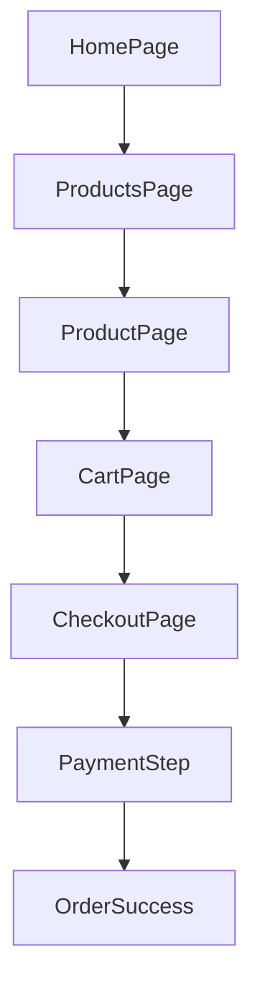
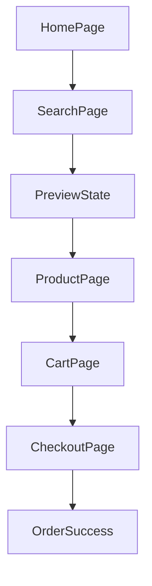
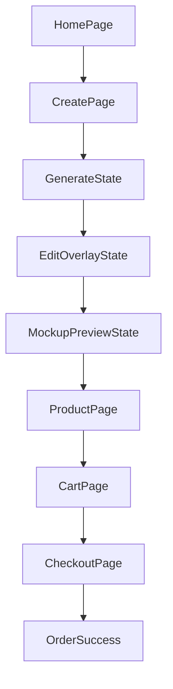

# UX Screen Flows

## Flow 1 Quick Buy

## Flow 2 Inspire

## Flow 3 Create

## Error and recovery patterns

- AI timeout: show retry + switch to quick buy recommendation.
- Invalid variant: inline validation and blocked CTA.
- Supplier unavailable: checkout banner + alternative product CTA.
- Payment failure: return to checkout with retry payment CTA.
- Return abuse escalation: clear pending moderation status in account timeline.
